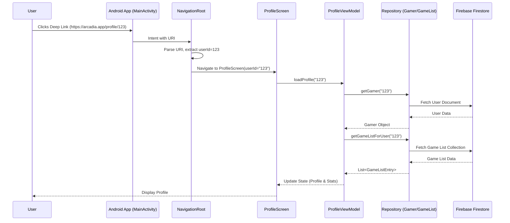
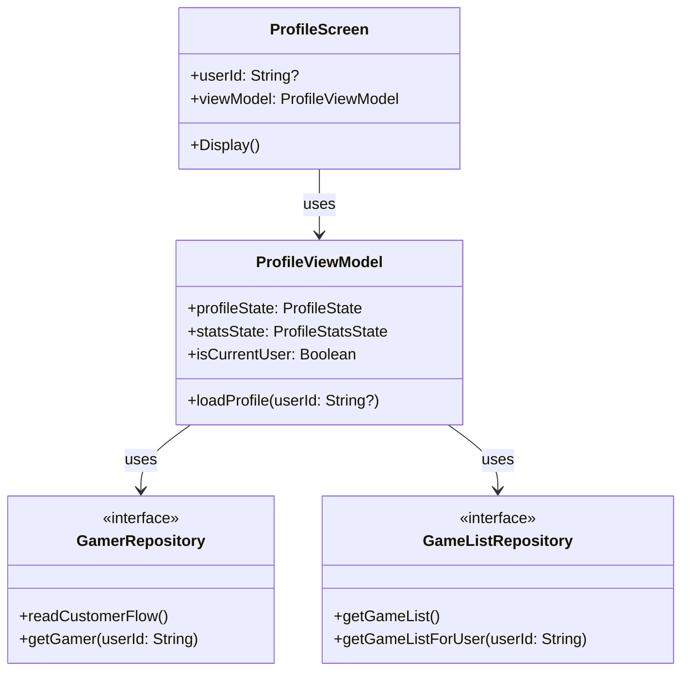

# Profile Sharing Implementation Documentation

## Overview
This document details the implementation of the profile sharing feature in the Arcadia application. The feature allows users to share their profile via a deep link (`https://arcadia.app/profile/{userId}`) and allows other users to view these profiles.

## Architecture
The implementation follows the **MVVM (Model-View-ViewModel)** pattern and **Clean Architecture** principles.

### Components Involved
1.  **Presentation Layer**:
    *   `ProfileScreen`: Displays the user profile. Updated to handle `userId` parameter and conditionally show edit controls.
    *   `ProfileViewModel`: Manages the state of the profile screen. Updated to load data for a specific user or the current user.
    *   `NavigationRoot`: Handles navigation and deep link parsing.
2.  **Domain Layer**:
    *   `GamerRepository`: Interface for user data operations. Added `getGamer(userId)`.
    *   `GameListRepository`: Interface for game list operations. Added `getGameListForUser(userId)`.
3.  **Data Layer**:
    *   `GamerRepositoryImpl`: Implementation using Firebase Firestore.
    *   `GameListRepositoryImpl`: Implementation using Firebase Firestore.

## Data Flow Diagram



## Implementation Details

### 1. Deep Link Configuration
Added an intent filter to `AndroidManifest.xml` to handle `https://arcadia.app/profile/*`.

```xml
<intent-filter>
    <action android:name="android.intent.action.VIEW" />
    <category android:name="android.intent.category.DEFAULT" />
    <category android:name="android.intent.category.BROWSABLE" />
    <data android:scheme="https" android:host="arcadia.app" android:pathPrefix="/profile" />
</intent-filter>
```

### 2. Navigation Logic
In `NavigationRoot.kt`, the deep link is intercepted, and the `userId` is extracted to set the start destination.

```kotlin
val deepLinkUserId = remember(intent) {
    intent?.data?.let { uri ->
        if (uri.host == "arcadia.app" && uri.pathSegments.firstOrNull() == "profile") {
            uri.pathSegments.getOrNull(1)
        } else null
    }
}
```

### 3. ViewModel Updates
`ProfileViewModel` was refactored to support loading any user's profile.

*   **`loadProfile(userId: String?)`**: Main entry point. If `userId` is null, it loads the current user.
*   **`isCurrentUser`**: A state variable to determine if the viewed profile belongs to the logged-in user.

### 4. Repository Extensions
New methods were added to repositories to fetch data for a specific user ID, ensuring separation of concerns and reusability.

*   `GamerRepository.getGamer(userId)`
*   `GameListRepository.getGameListForUser(userId)`

### 5. UI Adjustments
`ProfileScreen` now adapts based on `isCurrentUser`:
*   **Edit Profile** button is hidden for other users.
*   **Add Section** FAB is hidden for other users.
*   **Share** button generates the correct deep link.

## Class Diagram


